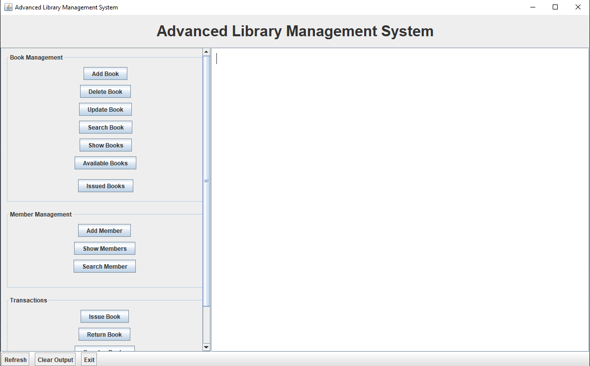
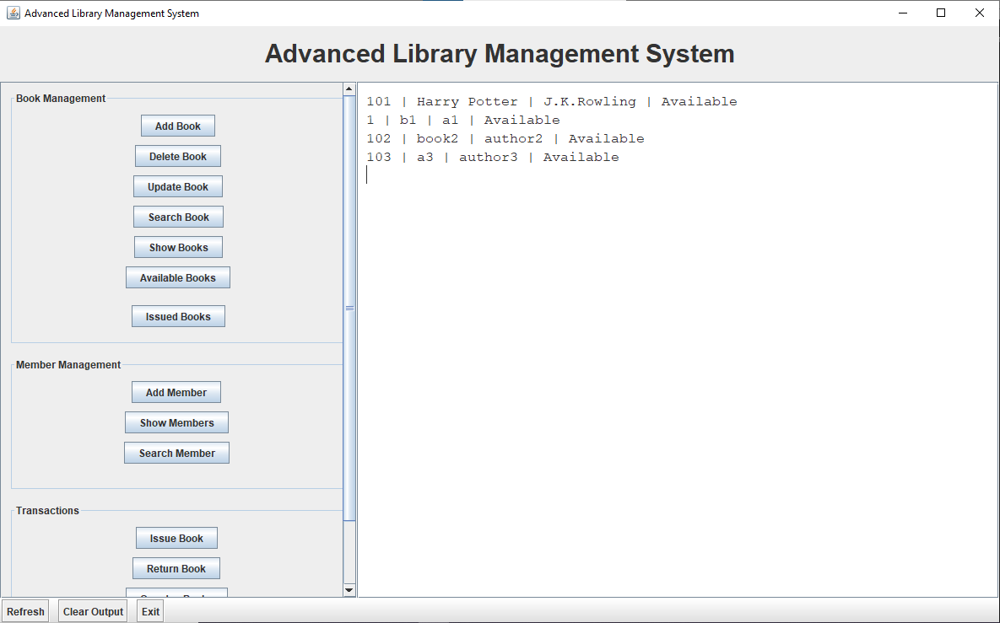
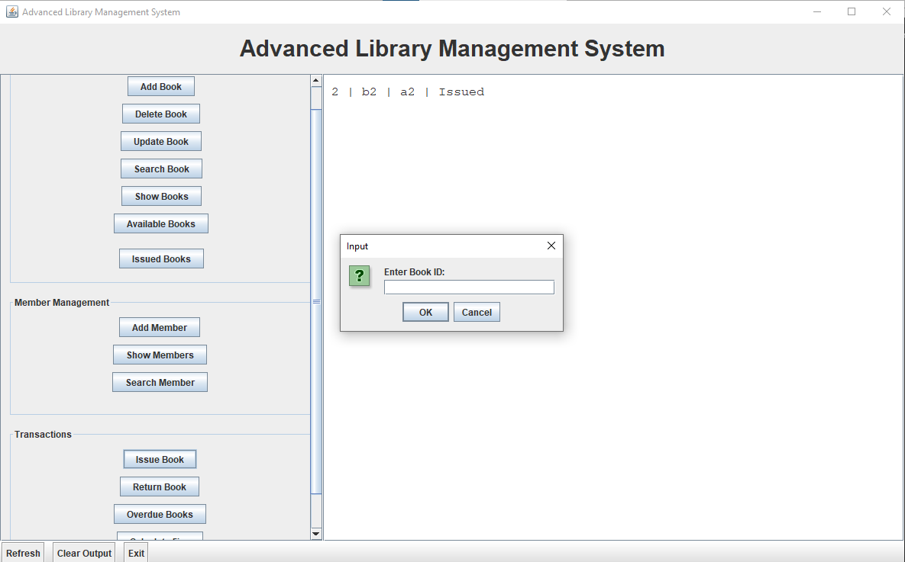

# Advanced Library Management System (Java)

<div align="center">


## Advanced_Library_Management_System_Java

A desktop based Library Management System built using Java, Object Oriented Programming, persistent file handling, and Java Swing.

The project models real world library workflows including:
book management, member management, issue-return lifecycle, overdue tracking, fine calculation, persistent storage, and event driven GUI interactions.

</div>

---

# Project Overview

This project started as a console based backend system and gradually evolved into a fully interactive desktop application.

The architecture focuses on:

* modular design
* entity relationships
* persistent state management
* reusable GUI components
* event driven programming
* scalable backend logic

---

# Current Features

## Book Management

* Add Books
* Update Book Details
* Delete Books
* Search Books
* Show All Books
* Show Available Books
* Show Issued Books

---

## Member Management

* Add Members
* Search Members
* Show All Members
* Track Issued Books Per Member

---

## Transaction System

* Issue Books
* Return Books
* Automatic Return Deadlines
* Book Availability Validation
* Member Validation

---

## Tracking & Analytics

* Overdue Book Detection
* Fine Calculation
* Real Time Overdue Tracking
* Issued Book Monitoring

---

## GUI Features

* Sidebar Navigation
* Scrollable Layout
* Event Driven Button Actions
* Dynamic Output Rendering
* Popup Input Dialogs
* Toolbar Utilities

---

# GUI Preview

## Main Interface

> Add your main GUI screenshot here

```md

```

---

## Book Management Workflow

> Add screenshot showing Add Book / Show Books

```md

```

---

## Issue / Return Workflow

> Add screenshot showing issued books or transactions

```md

```

---

# Project Structure

```text
Advanced_Library_Management_System_Java
│
├── Book.java
├── Member.java
├── LibraryManager.java
├── LibraryGUI.java
├── books.txt
├── README.md
└── screenshots/
```

---

# System Architecture

```text
                   +----------------------+
                   |      LibraryGUI      |
                   |----------------------|
                   | Swing Frontend       |
                   | Buttons              |
                   | Panels               |
                   | Output Area          |
                   +----------+-----------+
                              |
                              |
                              v
                  Event Driven Interactions
                              |
                              v
                   +----------------------+
                   |    LibraryManager    |
                   |----------------------|
                   | Book Operations      |
                   | Member Operations    |
                   | Issue / Return       |
                   | Overdue Tracking     |
                   | File Persistence     |
                   +----------+-----------+
                              |
              +---------------+---------------+
              |                               |
              v                               v
      +---------------+               +---------------+
      |     Book      |               |    Member     |
      |---------------|               |---------------|
      | title         |               | memberId      |
      | author        |               | name          |
      | bookId        |               | issuedBooks   |
      | isIssued      |               +---------------+
      | issueDate     |
      | returnDate    |
      +---------------+
```

---

# Event Driven GUI Flow

```text
User Clicks Button
        ↓
ActionListener Triggered
        ↓
LibraryGUI Handles Event
        ↓
LibraryManager Executes Logic
        ↓
Book / Member State Updated
        ↓
books.txt Updated
        ↓
Output Rendered In GUI
```

---

# Issue Book Workflow

```text
Find Book
    ↓
Find Member
    ↓
Validate Availability
    ↓
Update Book State
    ↓
Assign Return Deadline
    ↓
Add Book To Member
    ↓
Save To File
```

---

# Return Book Workflow

```text
Find Book
    ↓
Find Member
    ↓
Validate Ownership
    ↓
Reset Book State
    ↓
Remove Book From Member
    ↓
Persist Updated State
```

---

# Persistence Workflow

```text
Application Starts
        ↓
loadBooksFromFile()
        ↓
Book Objects Reconstructed
        ↓
User Interacts With GUI
        ↓
saveBooksToFile()
        ↓
books.txt Updated
```

---

# GUI Layout Structure

```text
 ---------------------------------------------------------
|            Advanced Library Management System           |
 ---------------------------------------------------------

 ---------------------------------------------------------
|  Book Panel  |                                         |
|  Member      |             Output Area                 |
|  Transactions|                                         |
|              |                                         |
 ---------------------------------------------------------

 ---------------------------------------------------------
| Refresh | Clear Output | Exit                          |
 ---------------------------------------------------------
```

---

# OOP Concepts Used

* Classes and Objects
* Constructors
* Encapsulation
* Getters and Setters
* Object Relationships
* State Management
* Modular Architecture
* Helper Methods

---

# Java Concepts Used

* ArrayList
* LocalDate
* ChronoUnit
* Swing GUI
* File Handling
* BufferedWriter
* Scanner
* Event Driven Programming
* Layout Managers
* Exception Handling

---

# Encapsulation Example

Critical fields are protected using:

```java
private
```

and accessed using getters/setters.

This improves:

* maintainability
* validation handling
* controlled state updates
* data safety

---

# Current Functionalities

| Feature               | Status   |
| --------------------- | -------- |
| Book CRUD             | Complete |
| Member Management     | Complete |
| Issue / Return System | Complete |
| Overdue Tracking      | Complete |
| Fine Calculation      | Complete |
| Persistent Storage    | Complete |
| Swing GUI Integration | Complete |
| Event Driven Actions  | Complete |
| Object Relationships  | Complete |

---

# Development Notes

This project was implemented incrementally with focus on:

* backend architecture first
* GUI integration after backend stabilization
* reusable methods
* layered separation of concerns
* gradual feature scaling

The application logic was manually structured and integrated step by step instead of blindly generating full code in one pass.

---

# Planned Improvements

* Database Integration
* Authentication System
* Admin Dashboard
* Book Categories
* Search Filters
* Statistics Panel
* Dark Mode GUI
* Better UI Styling

---

# How To Run

## Compile

```bash
javac *.java
```

## Run

```bash
java LibraryGUI
```

---

# Author

## JatinChoudhary-07

Built as part of Java OOP, backend architecture, persistence systems, and desktop GUI learning progression.
